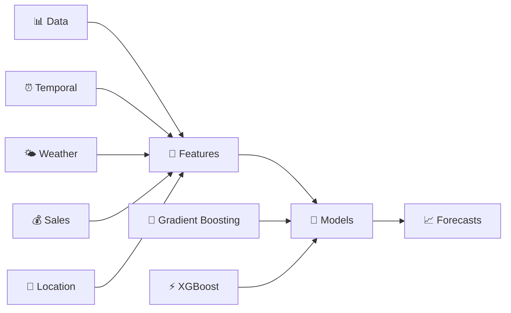

# 📊 Weekly Sales Forecasting

> **Machine learning sales forecasting system** with weather integration and interactive dashboard

[](https://python.org)
[](https://streamlit.io)
[](https://xgboost.readthedocs.io)

## ✨ Features

| Feature | Description |
|---------|-------------|
| 🏢 **Multi-Location** | 4 Dutch retail locations |
| 🤖 **ML Models** | Gradient Boosting & XGBoost |
| 🌤️ **Weather Integration** | Weather data as predictive features |
| 📱 **Interactive Dashboard** | Streamlit web interface |
| 💾 **Model Persistence** | Versioning & metadata |
| 📈 **Forecasting** | Daily & weekly predictions |
| 📊 **Performance Metrics** | MAE, RMSE, R² score |
| ✅ **Data Validation** | Preprocessing & quality checks |

## 🏪 Business Locations

| Location | ID | Records |
|----------|----|---------:|
| **Fenix Food Factory B.V.** | 50460 | 412 |
| **Kaapse Will'ns B.V.** | 47904 | 302 |
| **Kaapse Maria B.V.** | 47903 | 365 |
| **Kaapse Kaap B.V.** | 47901 | 94 |

## 📁 Project Structure

```bash
weekly_sales_forecasting/
├── 📊 streamlit_app.py                    # Main dashboard (2,835 lines)
├── 🔬 sales_forecasting.py               # Core algorithms (234 lines)  
├── ✅ checks.py                           # Validation (170 lines)
├── 📋 requirements.txt                    # Dependencies
├── 🚀 Procfile                            # Deployment
├── 🐍 runtime.txt                         # Python version
├── ⚙️  .streamlit/config.toml              # App configuration
├── 📂 data/                               # Data files
│   ├── All_Locations_Combined.csv        # 📊 Combined (477 records)
│   ├── Fenix_Food_Factory_B.V._50460.csv # 🏭 Factory (412 records)
│   ├── Kaapse_Will'ns_B.V._47904.csv     # 🏪 Will'ns (302 records)
│   ├── Kaapse_Maria_B.V._47903.csv       # 🏪 Maria (365 records)
│   ├── Kaapse_Kaap_B.V._47901.csv        # 🏪 Kaap (94 records)
│   ├── Weather_May15_to_May27.csv        # 🌤️ Recent weather
│   ├── Weather_Kaapse_Kaap_47901.csv     # 🌤️ Location weather
│   └── dataset details.pdf               # 📖 Documentation
└── 💾 models/                             # Model storage
    ├── model_combined_gradient_boosting_*.pkl
    ├── model_combined_xgboost_*.pkl
    └── Versioned with timestamp & feature hash
```


## 🗃️ Data Structure

<details>
<summary><strong>📊 Sales Data Schema</strong></summary>

| Field | Type | Description |
|-------|------|-------------|
| `Operational Date` | Date | Daily timestamp |
| `Total_Sales` | Float | Revenue amount |
| `Sales_Count` | Integer | Transaction count |
| `Day_of_Week` | String | Monday-Sunday |
| `Is_Weekend` | Boolean | Weekend flag |
| `Is_Public_Holiday` | Boolean | Holiday flag |
| `Is_Closed` | Boolean | Store closure |
| `Tips_per_Transaction` | Float | Average tips |
| `Avg_Sale_per_Transaction` | Float | Average sale value |

</details>

<details>
<summary><strong>🌤️ Weather Data Schema</strong></summary>

| Field | Type | Description |
|-------|------|-------------|
| `tempmax/tempmin/temp` | Float | Temperature (°F) |
| `humidity` | Float | Humidity % |
| `precip` | Float | Precipitation |
| `precipprob` | Float | Precipitation % |
| `cloudcover` | Float | Cloud coverage % |
| `solarradiation` | Float | Solar radiation |
| `uvindex` | Float | UV index |

</details>

## 🤖 Machine Learning



| Component | Details |
|-----------|---------|
| **🎯 Models** | Gradient Boosting, XGBoost |
| **🔧 Features** | Temporal, weather, sales patterns, location-specific |
| **✅ Validation** | Cross-validation with MAE, RMSE, R² |
| **💾 Management** | Versioning, compression, caching, cleanup |

## 📱 Dashboard

| Section | Features |
|---------|----------|
| **🎛️ Interface** | Company selection, date range, model config |
| **📊 Visualization** | Historical trends, forecasts, metrics |
| **📈 Analytics** | Time series, model comparison, reports |

## 🛠️ Technical Stack

| Category | Technologies |
|----------|--------------|
| **🖥️ Framework** |  |
| **🤖 ML** |   |
| **📊 Data** |   |
| **📈 Visualization** |   |
| **💾 Storage** | Joblib, compressed models with metadata |

## 📋 File Details

| File | Purpose | Key Features |
|------|---------|--------------|
| **📊 streamlit_app.py** | Main dashboard | Caching, data management, ML training, visualization |
| **🔬 sales_forecasting.py** | Core algorithms | Statistical analysis, model training, evaluation |
| **✅ checks.py** | Validation system | Dependencies, data integrity, deployment testing |

## 🚀 Deployment

<div align="center">

**Ready for Deployment:**

[](https://streamlit.io/cloud)

</div>

**Configuration files:** `Procfile` • `runtime.txt` • `requirements.txt` • `.streamlit/config.toml`

---

<div align="center">
<strong>📊 Sales Forecasting Dashboard</strong><br>
<em>Powered by Machine Learning & Weather Intelligence</em>
</div> 
